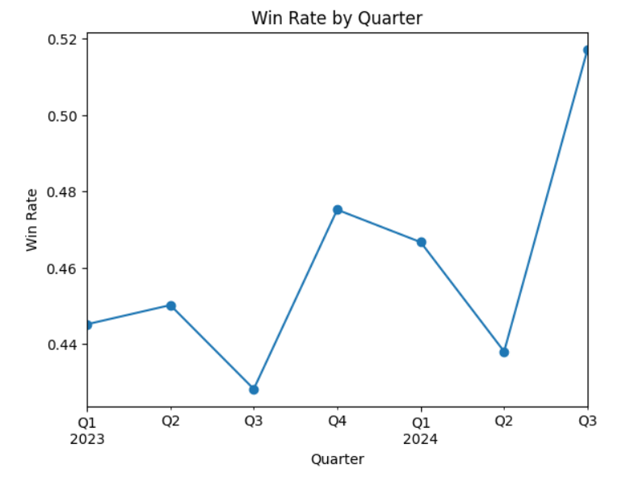

# 📊 Sales Decision Intelligence System

## Overview

This project simulates a lightweight **Sales Insight & Deal Risk Scoring System** for a B2B SaaS company.

The goal is to help sales leaders understand:

* Why win rate may be declining
* Where pipeline value is exposed to risk
* Which deals require immediate attention

Instead of focusing on adding more pipeline, this system prioritizes **smarter deal management and decision support**.

---

## Win Rate Trend



---

## 📂 Dataset

This project uses a simulated B2B SaaS sales dataset containing 5,000 deals with the following fields:
* `deal_id`
* `sales_rep_id`
* `deal_amount`
* `sales_cycle_days`
* `deal_stage`
* `lead_source`
* `product_type`
* `region`
* `industry`
* `outcome`
* `created_date`
* `closed_date`

The dataset represents CRM-style historical deal data used to analyze win rate trends and build a risk scoring system.

---


# My Approach

### 1️. Business Problem Framing

The CRO reported:

> “Win rate has dropped, but pipeline volume looks healthy.”

This suggests that the issue is not deal quantity, but deal quality, prioritization, and conversion efficiency.

---


### 2️. Data Exploration

I performed exploratory analysis to understand:

* Win rate by quarter
* Win rate by product type
* Win rate by lead source
* Pipeline efficiency

This helped identify patterns and potential performance gaps.

---

### 3️. Custom Metrics

To move beyond standard metrics, I created:

#### 🔹 Deal Risk Index (DRI)

Measures risk based on:

* Sales cycle length
* Deal amount

Big + slow deals are considered higher risk.

```
Deal Risk Index = 
(sales_cycle_days / max) * (deal_amount / max)
```

Higher score → higher relative risk.

---

#### 🔹 Deal Velocity Score (DVS)

Measures how efficiently revenue is progressing:

```
Deal Velocity Score = deal_amount / sales_cycle_days
```

Higher score → faster revenue movement
Lower score → potential stagnation

---

### 4️. Risk Categorization

Deals were bucketed into:

* Low Risk
* Medium Risk
* High Risk

This converts raw scores into **clear business priorities**.

---

### 5️. Pipeline Exposure Analysis

I evaluated how much total pipeline value exists within each risk bucket to understand revenue concentration risk.

---

### 6️. Mini System Design

I designed a lightweight Sales Insight & Alert System:

CRM → Feature Engine → Risk Scoring → Alerts → Sales Leader Actions

The system provides:

* Top high-risk deals
* Revenue exposure alerts
* Win rate trend monitoring
* Pipeline health signals

---

# ⚙️ How to Run the Project

### 1️. Clone the Repository

```bash
git clone https://github.com/your-username/sales-decision-intelligence.git
cd sales-decision-intelligence
```

---

### 2️. Create Virtual Environment (Optional)

```bash
python -m venv venv
source venv/bin/activate   # Mac/Linux
venv\Scripts\activate      # Windows
```

---

### 3️. Install Dependencies

```bash
pip install -r requirements.txt
```

---

### 4️. Run the Notebook

Open:

```
Sales Intelligence Challenge.ipynb
```

Run all cells to reproduce:

* Risk scoring
* Win rate trends
* Pipeline exposure analysis
* Insights and alerts

---

#  Key Decisions

### 1️. Chose Rule-Based Risk Scoring

Instead of complex ML models, I used interpretable logic based on deal size and duration. This keeps the system explainable and aligned with business users.

---

### 2️. Focused on Actionability Over Accuracy

The objective was not Kaggle-style prediction accuracy, but building a system that:

* Surfaces revenue risk
* Drives prioritization
* Supports CRO decision-making

---

### 3️. Normalization for Interpretability

Both deal size and sales cycle were normalized to ensure risk scores are comparable and easy to interpret (0–1 range).

---

### 4️. Emphasized Revenue Exposure

Rather than only counting risky deals, I measured how much pipeline value sits in high-risk buckets.

This aligns directly with executive-level concerns.

---

### 5️. Designed for Extensibility

The system can evolve into:

* ML-based win probability prediction
* Rep performance modeling
* Next Best Action recommendation engine

---

# 🚀 Business Value

This system helps:

* Identify revenue at risk
* Improve deal prioritization
* Increase forecast reliability
* Improve win rate without increasing pipeline volume

---

#  Future Improvements

* Predictive win probability modeling
* Dynamic risk thresholds based on historical performance
* Automated Slack/Email alert integration
* Segment-specific scoring models

---

# 🏁 Conclusion

This project demonstrates how simple, interpretable analytics can evolve into a lightweight Decision Intelligence System that bridges data science and business execution.

The focus was on clarity, actionability, and real-world practicality.

---
